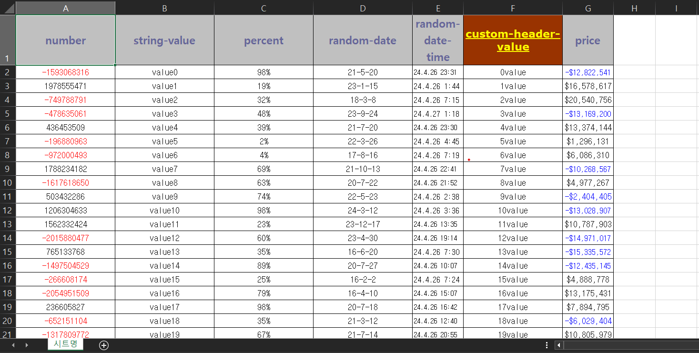
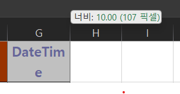

# Simple Excel Download Module (Object to Excel)

---
**엑셀 리포트 생성 모듈**

이 모듈은 Java 환경에서 객체를 엑셀 파일로 변환해주는 간편한 기능을 제공합니다.

Java 환경에서 익숙한 `@annotation` 기반으로 설정할 수 있도록 개발되었습니다.

사용자는 컬럼마다 폰트, 배경, 테두리, 서식 등 자유롭게 커스터마이징 할 수 있습니다.

또한, 대용량 데이터를 처리하기 위해 streaming 방식을 채택하여 빠르고 효율적인 결과를 출력합니다.

현재는 단일 Sheet만 지원하지만, 편의성을 위해 다중 Sheet에 대한 지원도 고려하고 있습니다.


## 개발 환경

---

- spring boot 3.2.*
- jdk21
- gradle
- poi 5.*


## 사용 방법

---
1. save: 파일 경로 전달하면 상위 디렉터리까지 생성해서 파일을 저장합니다. (권한이 없다면 오류를 던질 수 있습니다.
2. export: ServletResponse 객체와 다운로드 파일명을 인수로 전달하면 브라우저에 전달할 수 있습니다.
```java
public class TestClass() {
	void excelCreateTest(HttpServletResponse res) {
		String path = "/directory/path/file.xlsx";
		TestVo testVo = new TestVo(-1234, "data1", 0.1, LocalDate.now(), LocalDateTime.now(), "value", 1);
		TestVo testVo1 = new TestVo(0, "data2", 0.2, LocalDate.now(), LocalDateTime.now(), "value", 12);

		List<TestVo> list = List.of(testVo, testVo1);

		// 호출 방법
		ExcelExporter excel = ExcelFactory.makeExcel(list, TestVo.class);
		excel.save(path); 
		// save or export 
		excel.export(res, "다운로드 파일 명");

		assertTrue(Files.exists(Path.of(path)));
	}
}
```


### 객체 사용 방법

---
객체에는 일부 실제로 사용할 만한 기능들에 대해서 작성해놓았습니다.

해당 객체에 대한 결과는 아래 사진에 있습니다.
```java
@ExcelSheet(name = "시트명")
@AllArgsConstructor
public class TestVo {

	@ExcelHeader(name = "number", order = 0)
	@ExcelBody(order = 0, dataFormat = "0;[Red]-0")
	private int number;

	@ExcelHeader(name = "default", order = 1)
	@ExcelBody(order = 1)
	private String value;

	@ExcelHeader(name = "percent", order = 2)
	@ExcelBody(order = 2, dataFormat = "0%")
	private double percent;

	@ExcelHeader(name = "Date", order = 3)
	@ExcelBody(order = 3, dataFormat = "yy-m-d")
	private LocalDate localDate;

	@ExcelHeader(name = "DateTime", order = 4, width = 10.00f)
	@ExcelBody(order = 4, dataFormat = "yy.m.d h:mm",
			alignmentStyle = @ExcelAlignmentStyle(
					horizontalAlign = HorizontalAlignment.LEFT
			)
	)
	private LocalDateTime localDateTime;

	@ExcelHeader(name = "Custom", order = 5,
	backgroundStyle = @ExcelBackgroundStyle(
			color = IndexedColors.BROWN),
			fontStyle = @ExcelFontStyle(
					fontSize = 13,
					fontName = "verdana",
					bold = true,
					underline = Font.U_SINGLE,
					fontColor = HSSFColorPredefined.YELLOW))
	@ExcelBody(order = 5, dataFormat = "yy/m/d h:mm")
	private String customValue;

	@ExcelHeader(name = "DateTime", order = 6, width = 10.00f)
	@ExcelBody(order = 6, dataFormat = "$#,##0;[Blue]-$#,##0")
	private int won;
}

```

폰트 위치, 배경, 테두리, 폰트, 서식 등 다양한 어노테이션을 지원합니다.

dataFormat 을 통해 필드에 맞는 서식을 적용해서 숫자, 통화, 회계, 날짜, 백분율, 시간 등 원하는 서식 옵션을 지정해서 
더욱 고급진 엑셀 결과를 출력해 보세요.

[Data Formatter 사용방법](https://poi.apache.org/apidocs/dev/org/apache/poi/ss/usermodel/DataFormatter.html)
을 참고해 주세요. (옵션)




너비를 컬럼별로 지정할 수 있습니다. 

ex) 10.00f 값을 주면 고정 너비로 설정할 수 있습니다.
20.70f 처럼 소숫점을 입력해도 디테일하게 너비를 세팅해줍니다.


## Ver2. (예정)

---
- [ ] MultiSheet 지원
- [ ] 커스텀 함수 지원


